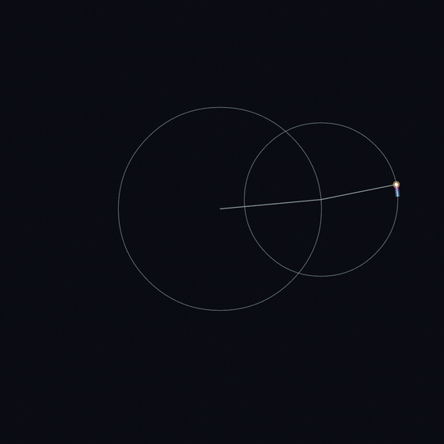
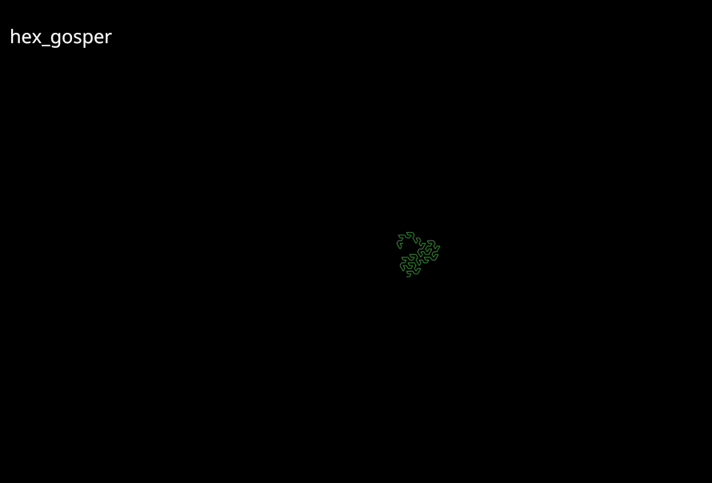
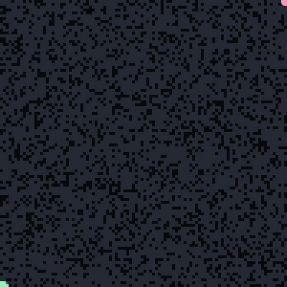
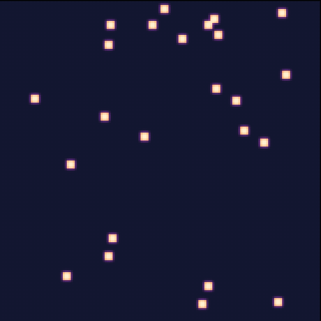
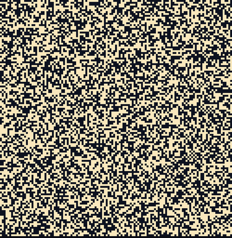

# nannou-playground

Animation projects that leverage the excellent [nannou](https://nannou.cc/) library.

## Projects

### <kbd>fft</kbd>

This visualizes principles of [Fast Fourier Transform](https://en.wikipedia.org/wiki/Fast_Fourier_transform) as system of rotating lines.

### <kbd>fractal</kbd>

This visualizes a fractal tree using the [Lindenmayer
system](https://en.wikipedia.org/wiki/L-system) and Koch curve.

Press `R` to switch between different preset fractal curves.

### <kbd>pathfinding</kbd>

This visualizes a pathfinding algorithm using the [A*
search](https://en.wikipedia.org/wiki/A*_search_algorithm) algorithm, BFS, DFS
and [beam search](https://en.wikipedia.org/wiki/Beam_search).

### <kbd>browian</kbd>

This visualizes a [Browian
motion](https://en.wikipedia.org/wiki/Brownian_motion).

### <kbd>diffusion</kbd>

This visualizes a [Reaction-diffusion system](https://en.wikipedia.org/wiki/Reaction%E2%80%93diffusion_system).

### <kbd>hopfield</kbd>

This visualizes a [Hopfield
network](https://en.wikipedia.org/wiki/Hopfield_network).

